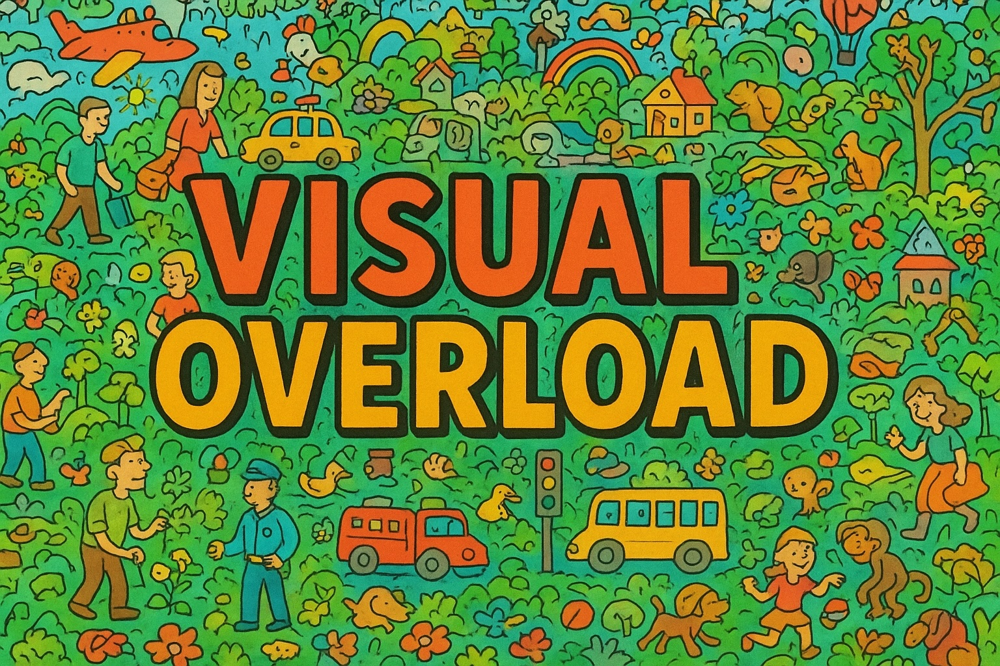
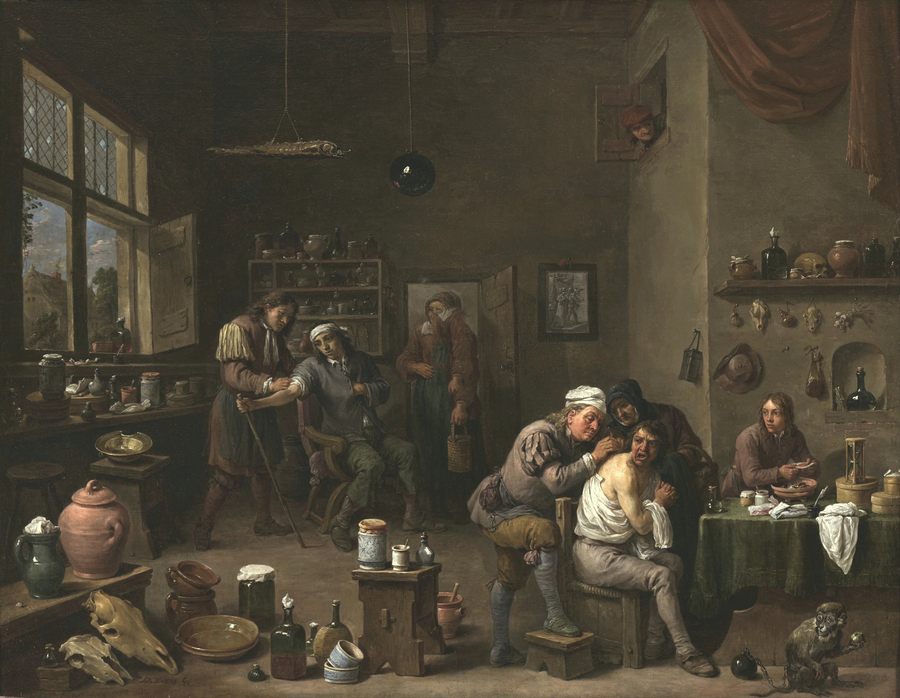

<p align="center">
 <br>
</p>

# VisualOverload

<p align="center">
[<a href="http://arxiv.org/abs/2509.25339">📚 Paper</a>] 
[<a href="https://huggingface.co/datasets/paulgavrikov/visualoverload">🤗 Dataset on HuggingFace</a>]
[<a href="https://huggingface.co/spaces/paulgavrikov/visualoverload-submit">🏆 Leaderboard</a>]
[<a href="https://huggingface.co/spaces/paulgavrikov/visualoverload-submit">🎯 Online Evaluator</a>]
</p>


Is basic visual understanding really solved in state-of-the-art VLMs? We present VisualOverload, a slightly different visual question answering (VQA) benchmark comprising 2,720 question–answer pairs, with privately held ground-truth responses. Unlike prior VQA datasets that typically focus on near global image understanding, VisualOverload challenges models to perform simple, knowledge-free vision tasks in densely populated (or, overloaded) scenes. Our dataset consists of high-resolution scans of public-domain paintings that are populated with multiple figures, actions, and unfolding subplots set against elaborately detailed backdrops. We manually annotated these images with questions across six task categories to probe for a thorough understanding of the scene. We hypothesize that current benchmarks overestimate the performance of VLMs, and encoding and reasoning over details is still a challenging task for them, especially if they are confronted with densely populated scenes. Indeed, we observe that even the best model (o3) out of 37 tested models only achieves 19.6% accuracy on our hardest test split and overall 69.5% accuracy on all questions. Beyond a thorough evaluation, we complement our benchmark with an error analysis that reveals multiple failure modes, including a lack of counting skills, failure in OCR, and striking logical inconsistencies under complex tasks. Altogether, VisualOverload exposes a critical gap in current vision models and offers a crucial resource for the community to develop better models.

#### Examples

<table align="left">
  <tr>
    <td>Image:</td>
    <td></td>
    <td></td>
    <td></td>
  </tr>
  <tr align="left">
    <td>Task:</td>
    <td><b>Reasoning<b></td>
    <td><b>OCR<b></td>
    <td><b>Counting<b></td>
  </tr>
  <tr align="left">
    <td>Question:</td>
    <td>Depending on the shadow of the people, what is the most likely position of the sun?</td>
    <td>What is the ninth word of the caption below the image?</td>
    <td>How many live animals can be seen?</td>
  </tr>
  <tr align="left">
    <td>Options:</td>
    <td>A. behind the right building,
      B. behind the left building,
      C. its night time,
      D. behind the middle tower</td>
    <td>(freeform)</td>
    <td>(freeform)</td>
  </tr>
</table>


## 📂 Load the dataset

The easiest way to load the dataset is to use HuggingFace's `datasets`.

```python
from datasets import load_dataset

vol_dataset = load_dataset("paulgavrikov/visualoverload")
```

Each sample contains the following fields

- `question_id`: Unique identifier of each question. 
- `image`: A PIL JPEG image. Most of our images match the total pixel count of 4k (3840x2160 px) in different aspect ratios. 
- `question`: A question about the image.
- `question_type`: Type of question. Will be one of `choice` (response expected to be "A", "B", "C", or "D"), `counting` (freeform), or `ocr` (freeform). You can use this information to request a suitable output format. 
- `options`: This is the list of options for `question_type=choice` and empty otherwise. Please treat the options as answers options `A, B, C, D` (4 options) or `A, B` (2 options).
- `difficulty`: Meta-data about the difficulty of the question. One of `easy`, `medium`, or `hard`.
- `category`:  Meta-data about the question task. One of `activity`, `attributes`, `counting`, `ocr`, `reasoning`, or `scene`.
- `default_prompt`: You can use this prompt to stay compliant with our results. It is a simple combination of the question and answers, with some additional output format constraints. This should work well for most models.

## 🎯 Evaluate your model

Please see eval.py for an example evaluation script that generates a correct submission JSON.

All of our ground truth labels are private. The only way to score your submission is to use the [evaluation server](https://huggingface.co/spaces/paulgavrikov/visualoverload-submit). You will need to sign in with a HuggingFace account.  

Your predictions should be a list of dictionaries, each containing an `question_id` field and a `response` field. For multiple choice questions, the `response` field should contain the predicted answer choice. For open-ended questions, the `response` field should contain the option letter (A-D). We will apply simple heuristics to clean the responses, but please ensure they are as accurate as possible.

Example: 
```
[
    {"question_id": "28deb79e", "response": "A"}, 
    {"question_id": "73cbabd7", "response": "C"}, 
    ...
]
```

## 🏆 Submit to the leaderboard
We welcome all submissions for model *or* method (including prompting-based) to our dataset. Please create an issue following the template and include your predictions as JSON. 


## 📝 License

Our dataset is licensed under CC BY-SA 4.0. All images are based on artwork that is royalty-free public domain (CC0).

## 📚 Citation

```latex
@misc{gavrikov2025visualoverload,
      title={VisualOverload: Probing Visual Understanding of VLMs in Really Dense Scenes}, 
      author={Paul Gavrikov and Wei Lin and M. Jehanzeb Mirza and Soumya Jahagirdar and Muhammad Huzaifa and Sivan Doveh and Serena Yeung-Levy and James Glass and Hilde Kuehne},
      year={2025},
      eprint={2509.25339},
      archivePrefix={arXiv},
      primaryClass={cs.CV},
      url={https://arxiv.org/abs/2509.25339}, 
}
```
